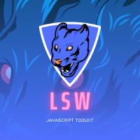
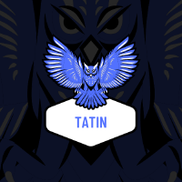
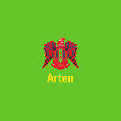
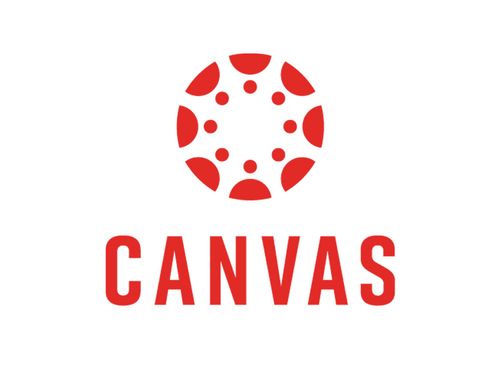
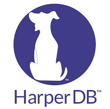
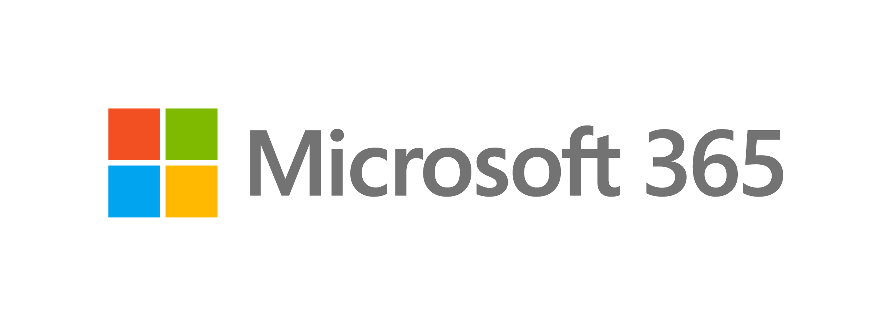
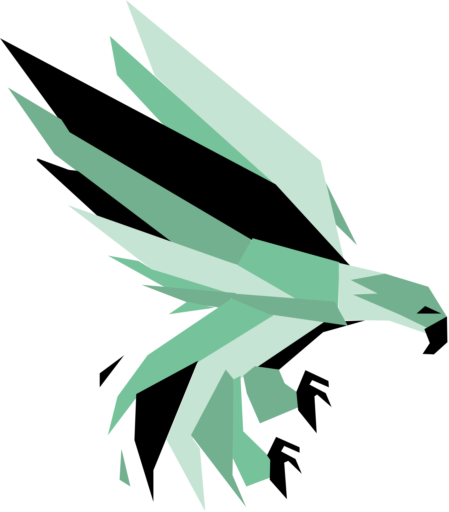
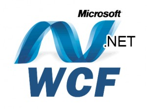
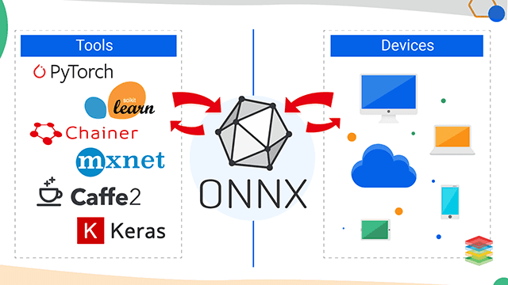

<h2 align="center">About me</h2>

```asm
.MODEL SMALL
 .STACK 100H

 .DATA
    STRING_1  DB  'My full name is Hau Trung Nguyen $'
    STRING_2  DB  'My job: Research and create smart technologies and solutions$'

 .CODE
   MAIN PROC
     MOV AX, @DATA
     MOV DS, AX

     LEA DX, STRING_1
     MOV AH, 9
     INT 21H

     MOV AH, 2
     MOV DL, 0DH
     INT 21H

     MOV DL, 0AH
     INT 21H

     LEA DX, STRING_2
     MOV AH, 9
     INT 21H

     MOV AH, 4CH
     INT 21H
   MAIN ENDP
 END MAIN
```

## <p align="center">You can reach me at 🌹</p>

<p align="center">
  <a href="mailto:haunt.hcm2015@gmail.com">
    
  </a>
  <a href="https://www.patreon.com/topweb">
    
  </a>
  <a href="https://gitee.com/techhack">
    
  </a>
	<a href="https://dev.to/fullstackhacker">
    
  </a>
  <a href="https://community.ops.io/techhack">
    
  </a>
  <a href="https://www.tiktok.com/@fullstackhacker">
    
  </a>
  <a href="https://github.com/haunt99">
    
  </a>

  <a href="https://bitbucket.org/haunt99">
    
  </a>
  <a href="https://gitlab.com/flightstar">
    
  </a>
  <a href="https://codepen.io/php-hacker">
    
  </a>
  <a href="http://jsfiddle.net/user/jshacker9999">
    
  </a>
  <a href="http://codesandbox.io/u/jshacker9999">
    
  </a>
  <a href="http://plnkr.co/users/jshacker9999/plunks">
    
  </a>
</p>

## <p align="center">I work on open source technology projects at</p>

<table align="center">
  <tbody>
    <tr valign="top">
      <td width="20%" align="center">
        <a href="https://github.com/heta999">
          <span>HETA</span><br><br><br>
          
        </a>
      </td>
      <td width="20%" align="center">
        <a href="https://github.com/lsw9">
          <span>LSW</span><br><br><br>
          
        </a>
      </td>
      <td width="20%" align="center">
        <a href="https://github.com/tatin9">
          <span>TATIN</span><br><br><br>
          
        </a>
      </td>
      <td width="20%" align="center">
        <a href="https://github.com/kucka9">
          <span>KUCKA</span><br><br><br>
          
        </a>
      </td>
      <td width="20%" align="center">
        <a href="https://github.com/poko99">
          <span>POKO</span><br><br><br>
          
        </a>
      </td>
    </tr>
    <tr valign="top">
      <td width="20%" align="center">
        <a href="https://github.com/xuou9">
            <span>XUOU</span><br><br><br>
            
        </a>
      </td>
      <td width="20%" align="center">
        <a href="https://github.com/femto8">
            <span>FEMTO</span><br><br><br>
            
        </a>
      </td>
      <td width="20%" align="center">
	      <a href="https://github.com/ten999">
        <span>TEN</span><br><br><br>
        
	      </a>
      </td>
	    <td width="20%" align="center">
        <a href="https://bitbucket.org/haunt99/workspace/projects/GAME">
          <span>GAME</span><br><br><br>
          
        </a>
      </td>
      <td width="20%" align="center">
	      <a href="https://github.com/oen-framework">
        <span>O E N</span><br><br><br>
        
	      </a>
      </td>
    </tr>
    <tr valign="top">
      <td width="20%" align="center">
        <a href="https://github.com/arten-channel">
            <span>Arten</span><br><br><br>
            
        </a>
      </td>
      <td width="20%" align="center">
        <a href="https://github.com/php-hacker">
            <span>PHP Hacker</span><br><br><br>
            
        </a>
      </td>
      <td width="20%" align="center">
	      <a href="https://github.com/jshacker9999">
        <span>Javascript Hacker</span><br><br><br>
        
	      </a>
      </td>
	    <td width="20%" align="center">
        <a href="https://github.com/java-hacker">
          <span>Java Hacker</span><br><br><br>
          
        </a>
      </td>
      <td width="20%" align="center">
        <a href="https://github.com/gis-research">
          <span>GIS Research</span><br><br><br>
          
        </a>
      </td>
    </tr>
     <tr valign="top">
      <td width="20%" align="center">
        <a href="https://github.com/turtle89">
            <span>AAA+</span><br><br><br>
            
        </a>
      </td>
      <td width="20%" align="center">
        <a href="https://github.com/vba99">
            <span>VBA</span><br><br><br>
            
        </a>
      </td>
      <td width="20%" align="center"></td>
      <td width="20%" align="center"></td>
      <td width="20%" align="center"></td>
    </tr>
  </tbody>
</table>

## <p align="center">In-depth research of some technologies</p>
  <table align="center">
    <tbody>
      <tr valign="top">
        <td width="20%" align="center">
          <a href="https://nextjs.org/">
            <span>Next JS</span><br><br><br>
            
          </a>
        </td>
        <td width="20%" align="center">
          <a href="https://ethers.org/">
            <span>Ethers.js</span><br><br><br>
            
          </a>
        </td>
        <td width="20%" align="center">
          <a href="https://backbonejs.org/">
            <span>Backbone.js</span><br><br><br>
            
          </a>
        </td>
        <td width="20%" align="center">
          <a href="https://emberjs.com/">
            <span>Ember.js</span><br><br><br>
            
          </a>
        </td>
        <td width="20%" align="center">
          <a href="https://polymer-library.polymer-project.org/">
            <span>Polymer.js</span><br><br><br>
            
          </a>
        </td>
      </tr>
      <tr valign="top">
        <td width="20%" align="center">
          <a href="https://ionicframework.com/">
            <span>Ionic</span><br><br><br>
            
          </a>
        </td>
        <td width="20%" align="center">
          <a href="https://svelte.dev/">
            <span>Svelte</span><br><br><br>
            
          </a>
        </td>
        <td width="20%" align="center">
          <a href="https://angular.io/">
            <span>Angular</span><br><br><br>
            
          </a>
        </td>
        <td width="20%" align="center">
          <a href="https://vuejs.org/">
            <span>Vue</span><br><br><br>
            
          </a>
        </td>
        <td width="20%" align="center">
          <a href="https://reactjs.org/">
            <span>React</span><br><br><br>
            
          </a>
        </td>
      </tr>
      <tr valign="top">
        <td width="20%" align="center">
          <a href="https://hibernate.org/">
            <span>Hibernate</span><br><br><br>
            
          </a>
        </td>
        <td width="20%" align="center">
          <a href="https://tomcat.apache.org/">
            <span>Tomcat Server</span><br><br><br>
            
          </a>
        </td>
        <td width="20%" align="center">
          <a href="https://www.nginx.com/">
            <span>Nginx</span><br><br><br>
            
          </a>
        </td>
        <td width="20%" align="center">
          <a href="https://httpd.apache.org/">
            <span>Apache Server</span><br><br><br>
            
          </a>
        </td>
        <td width="20%" align="center">
          <a href="https://glassfish.org/">
            <span>Glassfish Server</span><br><br><br>
            
          </a>
        </td>
      </tr>
      <tr valign="top">
        <td width="20%" align="center">
          <a href="https://lucene.apache.org/">
            <span>Apache Lucene</span><br><br><br>
            
          </a>
        </td>
        <td width="20%" align="center">
          <a href="https://www.elastic.co/">
            <span>Elasticsearch</span><br><br><br>
            
          </a>
        </td>
        <td width="20%" align="center">
          <a href="https://solr.apache.org/">
            <span>Solrcloud</span><br><br><br>
            
          </a>
        </td>
        <td width="20%" align="center">
          <a href="https://opensearch.org/">
            <span>OpenSearch</span><br><br><br>
            
          </a>
        </td>
        <td width="20%" align="center">
          <a href="https://www.algolia.com/">
            <span>Algolia</span><br><br><br>
            
          </a>
        </td>
      </tr>
      <tr valign="top">
        <td width="20%" align="center">
          <a href="https://www.sqlite.org/index.html">
            <span>SQLite</span><br><br><br>
            
          </a>
        </td>
        <td width="20%" align="center">
          <a href="https://aws.amazon.com/dynamodb">
            <span>DynamoDB</span><br><br><br>
            
          </a>
        </td>
        <td width="20%" align="center">
          <a href="https://firebirdsql.org/">
            <span>Firebirdsql</span><br><br><br>
            
          </a>
        </td>
        <td width="20%" align="center">
          <a href="https://couchdb.apache.org/">
            <span>CouchDB</span><br><br><br>
            
          </a>
        </td>
        <td width="20%" align="center">
          <a href="https://en.wikipedia.org/wiki/Assembly_language">
            <span>Assembly</span><br><br><br>
            
          </a>
        </td>
      </tr>
      <tr valign="top">
        <td width="20%" align="center">
          <a href="https://www.mongodb.com/">
            <span>MongoDB</span><br><br><br>
            
          </a>
        </td>
        <td width="20%" align="center">
          <a href="https://orientdb.org/">
            <span>OrientDB</span><br><br><br>
            
          </a>
        </td>
        <td width="20%" align="center">
          <a href="https://mariadb.org/">
            <span>MariaDB</span><br><br><br>
            
          </a>
        </td>
        <td width="20%" align="center">
          <a href="https://www.mysql.com/">
            <span>MySQL</span><br><br><br>
            
          </a>
        </td>
        <td width="20%" align="center">
          <a href="https://cassandra.apache.org/">
            <span>Cassandra</span><br><br><br>
            
          </a>
        </td>
      </tr>
      <tr valign="top">
        <td width="20%" align="center">
          <a href="https://unity.com/solutions/instant-games">
            <span>Instant Game</span><br><br><br>
            
          </a>
        </td>
        <td width="20%" align="center">
          <a href="https://www.facebook.com/fbgaminghome/developers/instant-games">
            <span>Facebook Game</span><br><br><br>
            
          </a>
        </td>
        <td width="20%" align="center">
          <a href="https://docs.unrealengine.com/4.27/en-US/SharingAndReleasing/Mobile/">
            <span>Mobile Game</span><br><br><br>
            
          </a>
        </td>
        <td width="20%" align="center">
          <a href="https://www.crazygames.com/t/webgl">
            <span>Web Game</span><br><br><br>
            
          </a>
        </td>
        <td width="20%" align="center">
          <a href="https://neo4j.com/">
            <span>Neo4j</span><br><br><br>
            
          </a>
        </td>
      </tr>
      <tr valign="top">
        <td width="20%" align="center">
          <a href="https://www.gnu.org/software/bash/">
            <span>Bash Script</span><br><br><br>
            
          </a>
        </td>
        <td width="20%" align="center">
          <a href="https://developer.mozilla.org/en-US/docs/Web/API/Canvas_API">
            <span>Canvas API</span><br><br><br>
            
          </a>
        </td>
        <td width="20%" align="center">
          <a href="https://docs.aws.amazon.com/route53/index.html">
            <span>Domain</span><br><br><br>
            
          </a>
        </td>
        <td width="20%" align="center">
          <a href="https://aws.amazon.com/websites/">
            <span>Hosting</span><br><br><br>
            
          </a>
        </td>
        <td width="20%" align="center">
          <a href="https://aws.amazon.com/elasticloadbalancing/">
            <span>Load balancer</span><br><br><br>
            
          </a>
        </td>
      </tr>
      <tr valign="top">
        <td width="20%" align="center">
          <a href="https://www.linux-kvm.org/page/Main_Page">
            <span>KVM</span><br><br><br>
            
          </a>
        </td>
        <td width="20%" align="center">
          <a href="https://www.citrix.com/">
            <span>Citrix</span><br><br><br>
            
          </a>
        </td>
        <td width="20%" align="center">
          <a href="https://www.vmware.com/asean/products/esxi-and-esx.html">
            <span>ESXi</span><br><br><br>
            
          </a>
        </td>
        <td width="20%" align="center">
          <a href="https://www.vmware.com/asean/products/vsphere.html">
            <span>vSphere</span><br><br><br>
            
          </a>
        </td>
        <td width="20%" align="center">
          <a href="https://docs.microsoft.com/en-us/powershell/">
            <span>PowerShell</span><br><br><br>
            
          </a>
        </td>
      </tr>
      <tr valign="top">
        <td width="20%" align="center">
          <a href="https://www.kernel.org/">
            <span>Linux</span><br><br><br>
            
          </a>
        </td>
        <td width="20%" align="center">
          <a href="https://www.microsoft.com/en-us/windows-server">
            <span>Windows Server</span><br><br><br>
            
          </a>
        </td>
        <td width="20%" align="center">
          <a href="https://docs.microsoft.com/en-us/virtualization/hyper-v-on-windows/about/">
            <span>HyperV</span><br><br><br>
            
          </a>
        </td>
        <td width="20%" align="center">
          <a href="https://www.virtualbox.org/">
            <span>Oracle VM Virtual Box</span><br><br><br>
            
          </a>
        </td>
        <td width="20%" align="center">
          <a href="https://www.vmware.com/asean/products/workstation-pro.html">
            <span>VMware Workstation</span><br><br><br>
            
          </a>
        </td>
      </tr>
      <tr valign="top">
        <td width="20%" align="center">
          <a href="https://www.oracle.com/database/">
            <span>Oracle Database</span><br><br><br>
            
          </a>
        </td>
        <td width="20%" align="center">
          <a href="https://www.postgresql.org/">
            <span>PostgreSQL</span><br><br><br>
            
          </a>
        </td>
        <td width="20%" align="center">
          <a href="https://redis.io/">
            <span>Redis</span><br><br><br>
            
          </a>
        </td>
        <td width="20%" align="center">
          <a href="https://harperdb.io/">
            <span>HarperDB</span><br><br><br>
            
          </a>
        </td>
        <td width="20%" align="center">
          <a href="https://memcached.org/">
            <span>Memcached</span><br><br><br>
            
          </a>
        </td>
      </tr>
      <tr valign="top">
        <td width="20%" align="center">
          <a href="https://gcorelabs.com/">
            <span>G-Core Labs Cloud</span><br><br><br>
            
          </a>
        </td>
        <td width="20%" align="center">
          <a href="https://alibabacloud.com">
            <span>Alibaba Cloud</span><br><br><br>
            
          </a>
        </td>
        <td width="20%" align="center">
          <a href="https://www.microsoft.com/en-us/microsoft-365">
            <span>Microsoft 365</span><br><br><br>
            
          </a>
        </td>
        <td width="20%" align="center">
          <a href="https://www.khronos.org/opengles/">
            <span>OpenGL ES</span><br><br><br>
            
          </a>
        </td>
        <td width="20%" align="center">
          <a href="https://www.microsoft.com/en-us/sql-server/">
            <span>SQL Server</span><br><br><br>
            
          </a>
        </td>
      </tr>
      <tr valign="top">
        <td width="20%" align="center">
          <a href="https://www.salesforce.com/">
            <span>Saleforces</span><br><br><br>
            
          </a>
        </td>
        <td width="20%" align="center">
          <a href="https://www.servicenow.com/">
            <span>ServicesNow</span><br><br><br>
            
          </a>
        </td>
        <td width="20%" align="center">
          <a href="https://www.ibm.com/cloud">
            <span>IBM Cloud</span><br><br><br>
            
          </a>
        </td>
        <td width="20%" align="center">
          <a href="https://cloud.google.com/appengine">
            <span>Google App Engine</span><br><br><br>
            
          </a>
        </td>
        <td width="20%" align="center">
          <a href="https://www.oracle.com/cloud/">
            <span>Oracle Cloud</span><br><br><br>
            
          </a>
        </td>
      </tr>
      <tr valign="top">
        <td width="20%" align="center">
          <a href="https://cloud.google.com/">
            <span>Google Cloud Platform</span><br><br><br>
            
          </a>
        </td>
        <td width="20%" align="center">
          <a href="https://aws.amazon.com/">
            <span>Amazon Web Services</span><br><br><br>
            
          </a>
        </td>
        <td width="20%" align="center">
          <a href="https://azure.microsoft.com/en-us/">
            <span>Microsoft Azure</span><br><br><br>
            
          </a>
        </td>
        <td width="20%" align="center">
          <a href="https://firebase.google.com/">
            <span>Firebase</span><br><br><br>
            
          </a>
        </td>
        <td width="20%" align="center">
          <a href="https://www.heroku.com/">
            <span>Heroku</span><br><br><br>
            
          </a>
        </td>
      </tr>
      <tr valign="top">
        <td width="20%" align="center">
          <a href="https://echarts.apache.org/en/index.html">
            <span>ECharts</span><br><br><br>
            
          </a>
        </td>
        <td width="20%" align="center">
          <a href="https://aframe.io/">
            <span>Aframe</span><br><br><br>
            
          </a>
        </td>
        <td width="20%" align="center">
          <a href="https://get.webgl.org/">
            <span>WebGL</span><br><br><br>
            
          </a>
        </td>
        <td width="20%" align="center">
          <a href="https://www.w3.org/TR/webgpu/">
            <span>WebGPU</span><br><br><br>
            
          </a>
        </td>
        <td width="20%" align="center">
          <a href="https://www.web3d.org/">
            <span>Web 3D</span><br><br><br>
            
          </a>
        </td>
      </tr>
      <tr valign="top">
        <td width="20%" align="center">
          <a href="https://training.sap.com/content/ABAP-programming-training">
            <span>SAP ABAP</span><br><br><br>
            
          </a>
        </td>
        <td width="20%" align="center">
          <a href="https://www.sap.com/sea/products/s4hana-erp.html">
            <span>SAP S/4Hana</span><br><br><br>
            
          </a>
        </td>
        <td width="20%" align="center">
          <a href="https://www.sap.com/sea/products/business-one.html">
            <span>SAP B1</span><br><br><br>
            
          </a>
        </td>
        <td width="20%" align="center">
          <a href="https://www.redhat.com/en/topics/devops/what-is-ci-cd">
            <span>CI/CD</span><br><br><br>
            
          </a>
        </td>
        <td width="20%" align="center">
          <a href="https://www.iso.org/standard/63555.html">
            <span>SQL</span><br><br><br>
            
          </a>
        </td>
      </tr>
      <tr valign="top">
        <td width="20%" align="center">
          <a href="https://developer.mozilla.org/en-US/docs/Web/CSS">
            <span>CSS</span><br><br><br>
            
          </a>
        </td>
        <td width="20%" align="center">
          <a href="https://tailwindcss.com/">
            <span>Tailwind CSS</span><br><br><br>
            
          </a>
        </td>
        <td width="20%" align="center">
          <a href="https://getbootstrap.com/">
            <span>Bootstrap</span><br><br><br>
            
          </a>
        </td>
        <td width="20%" align="center">
          <a href="https://opencv.org/">
              <span>OpenCV</span><br><br><br>
              
          </a>
        </td>
        <td width="20%" align="center">
  	      <a href="https://www.tensorflow.org/">
          <span>Tensorflow</span><br><br><br>
          
  	      </a>
        </td>
      </tr>
      <tr valign="top">
        <td width="20%" align="center">
          <a href="https://www.ruby-lang.org/en/">
            <span>Ruby</span><br><br><br>
            
          </a>
        </td>
        <td width="20%" align="center">
          <a href="https://rubyonrails.org/">
            <span>Ruby on Rails</span><br><br><br>
            
          </a>
        </td>
        <td width="20%" align="center">
  	      <a href="https://www.shopify.com/">
          <span>Shopify</span><br><br><br>
          
  	      </a>
        </td>
        <td width="20%" align="center">
  	      <a href="https://www.sanity.io/">
          <span>Sanity</span><br><br><br>
          
  	      </a>
        </td>
        <td width="20%" align="center">
  	      <a href="https://github.com/gis-research">
          <span>GIS System</span><br><br><br>
          
  	      </a>
        </td>
      </tr>
      <tr valign="top">
        <td width="20%" align="center">
          <a href="https://wordpress.org/">
            <span>Wordpress</span><br><br><br>
            
          </a>
        </td>
        <td width="20%" align="center">
          <a href="https://www.joomla.org/">
            <span>Joomla</span><br><br><br>
            
          </a>
        </td>
        <td width="20%" align="center">
          <a href="https://www.drupal.org/">
            <span>Drupal</span><br><br><br>
            
          </a>
        </td>
        <td width="20%" align="center">
          <a href="https://business.adobe.com/products/magento/magento-commerce.html">
              <span>Magento</span><br><br><br>
              
          </a>
        </td>
        <td width="20%" align="center">
  	      <a href="https://www.opencart.com/">
          <span>Opencart</span><br><br><br>
          
  	      </a>
        </td>
      </tr>
      <tr valign="top">
        <td width="20%" align="center">
          <a href="https://www.php.net/">
            <span>PHP</span><br><br><br>
            
          </a>
        </td>
        <td width="20%" align="center">
          <a href="https://laravel.com/">
            <span>Laravel</span><br><br><br>
            
          </a>
        </td>
        <td width="20%" align="center">
          <a href="https://phalcon.io">
            <span>Phalcon</span><br><br><br>
            
          </a>
        </td>
        <td width="20%" align="center">
          <a href="https://www.codeigniter.com/">
              <span>CodeIgniter</span><br><br><br>
              
          </a>
        </td>
        <td width="20%" align="center">
  	      <a href="https://www.yiiframework.com/">
          <span>Yii</span><br><br><br>
          
  	      </a>
        </td>
      </tr>
      <tr valign="top">
        <td width="20%" align="center">
          <a href="https://spring.io/">
            <span>Spring Framework</span><br><br><br>
            
          </a>
        </td>
        <td width="20%" align="center">
          <a href="https://kotlinlang.org/">
            <span>Kotlin</span><br><br><br>
            
          </a>
        </td>
        <td width="20%" align="center">
          <a href="https://www.unrealengine.com/">
            <span>Unreal Engine</span><br><br><br>
            
          </a>
        </td>
        <td width="20%" align="center">
          <a href="https://unity.com/">
              <span>Unity</span><br><br><br>
              
          </a>
        </td>
        <td width="20%" align="center">
  	      <a href="https://www.blender.org/">
          <span>Blender</span><br><br><br>
          
  	      </a>
        </td>
      </tr>
      <tr valign="top">
        <td width="20%" align="center">
          <a href="https://www.babylonjs.com/">
            <span>Babylon.js</span><br><br><br>
            
          </a>
        </td>
        <td width="20%" align="center">
          <a href="https://reactnative.dev/">
            <span>React Native</span><br><br><br>
            
          </a>
        </td>
        <td width="20%" align="center">
          <a href="https://github.com/threejs-expert">
            <span>Three.js</span><br><br><br>
            
          </a>
        </td>
        <td width="20%" align="center">
          <a href="https://d3js.org/">
            <span>D3.js</span><br><br><br>
            
          </a>
        </td>
        <td width="20%" align="center">
          <a href="https://p5js.org/">
            <span>P5.js</span><br><br><br>
            
          </a>
        </td>
      </tr>
      <tr valign="top">
        <td width="20%" align="center">
          <a href="https://devdocs.io/cpp/">
            <span>𝗖++</span><br><br><br>
            
          </a>
        </td>
        <td width="20%" align="center">
          <a href="https://docs.microsoft.com/dotnet/csharp/">
            <span>𝗖#</span><br><br><br>
            
          </a>
        </td>
        <td width="20%" align="center">
          <a href="https://docs.oracle.com/java/">
            <span>𝗝𝗮𝘃𝗮</span><br><br><br>
            
          </a>
        </td>
        <td width="20%" align="center">
          <a href="https://dart.dev/guides">
              <span>𝗗𝗮𝗿𝘁</span><br><br><br>
              
          </a>
        </td>
        <td width="20%" align="center">
  	      <a href="https://docs.python.org/3/">
          <span>𝗣𝘆𝘁𝗵𝗼𝗻</span><br><br><br>
          
  	      </a>
        </td>
      </tr>
      <tr valign="top">
        <td width="20%" align="center">
          <a href="https://code.visualstudio.com/docs">
              <span>𝗩𝗶𝘀𝘂𝗮𝗹 𝗦𝘁𝘂𝗱𝗶𝗼 𝗖𝗼𝗱𝗲</span><br><br><br>
              
          </a>
        </td>
        <td width="20%" align="center">
          <a href="https://docs.microsoft.com/visualstudio/ide/?view=vs-2019">
              <span>𝗩𝗶𝘀𝘂𝗮𝗹 𝗦𝘁𝘂𝗱𝗶𝗼</span><br><br><br>
              
          </a>
        </td>
        <td width="20%" align="center">
  	      <a href="https://developer.android.com/docs">
          <span>𝗔𝗻𝗱𝗿𝗼𝗶𝗱 𝗦𝘁𝘂𝗱𝗶𝗼</span><br><br><br>
          
  	      </a>
        </td>
  	    <td width="20%" align="center">
          <a href="https://docs.flutter.dev/">
            <span>𝗙𝗹𝘂𝘁𝘁𝗲𝗿</span><br><br><br>
            
          </a>
        </td>
        <td width="20%" align="center">
  	      <a href="https://git-scm.com/doc">
          <span>𝗚𝗶𝘁</span><br><br><br>
          
  	      </a>
        </td>
      </tr>
      <tr valign="top">
        <td width="20%" align="center">
          <a href="https://microservices.io/">
              <span>Microservices</span><br><br><br>
              
          </a>
        </td>
        <td width="20%" align="center">
          <a href="https://www.typescriptlang.org/">
              <span>Typescript</span><br><br><br>
              
          </a>
        </td>
        <td width="20%" align="center">
  	      <a href="https://docs.microsoft.com/en-us/dotnet/core/porting/">
          <span> .Net Core</span><br><br><br>
          
  	      </a>
        </td>
  	    <td width="20%" align="center">
          <a href="https://docs.microsoft.com/en-us/dotnet/desktop/wpf/advanced">
            <span>WPF</span><br><br><br>
            
          </a>
        </td>
        <td width="20%" align="center">
  	      <a href="https://docs.microsoft.com/en-us/dotnet/framework/wcf/">
          <span>WCF</span><br><br><br>
          
  	      </a>
        </td>
      </tr>
      <tr valign="top">
        <td width="20%" align="center">
          <a href="https://docs.microsoft.com/en-us/dotnet/visual-basic">
              <span>Visual Basic .NET</span><br><br><br>
              
          </a>
        </td>
        <td width="20%" align="center">
          <a href="https://docs.microsoft.com/en-us/office/vba/api/overview/">
              <span>VBA</span><br><br><br>
              
          </a>
        </td>
        <td width="20%" align="center">
  	      <a href="https://developer.apple.com/">
          <span>iOS</span><br><br><br>
          
  	      </a>
        </td>
  	    <td width="20%" align="center">
          <a href="https://developer.apple.com/swift/resources/">
            <span>Swift</span><br><br><br>
            
          </a>
        </td>
        <td width="20%" align="center">
  	      <a href="https://graphql.org/">
          <span>Graphql</span><br><br><br>
          
  	      </a>
        </td>
      </tr>
      <tr valign="top">
        <td width="20%" align="center">
          <a href="https://palletsprojects.com/p/flask/">
              <span>Flask</span><br><br><br>
              
          </a>
        </td>
        <td width="20%" align="center">
          <a href="https://www.djangoproject.com/">
              <span>Django</span><br><br><br>
              
          </a>
        </td>
        <td width="20%" align="center">
  	      <a href="https://www.odoo.com/">
          <span>Odoo</span><br><br><br>
          
  	      </a>
        </td>
  	    <td width="20%" align="center">
          <a href="https://numpy.org/">
            <span>NumPy</span><br><br><br>
            
          </a>
        </td>
        <td width="20%" align="center">
  	      <a href="https://scrapy.org/">
          <span>Scrapy</span><br><br><br>
          
  	      </a>
        </td>
      </tr>
      <tr valign="top">
        <td width="20%" align="center">
          <a href="https://scikit-learn.org/stable/">
              <span>Scikit-learn</span><br><br><br>
              
          </a>
        </td>
        <td width="20%" align="center">
          <a href="https://matplotlib.org/">
              <span>Matplotlib</span><br><br><br>
              
          </a>
        </td>
        <td width="20%" align="center">
  	      <a href="https://scipy.org/">
          <span>SciPy</span><br><br><br>
          
  	      </a>
        </td>
  	    <td width="20%" align="center">
          <a href="https://pandas.pydata.org/">
            <span>Pandas</span><br><br><br>
            
          </a>
        </td>
        <td width="20%" align="center">
  	      <a href="https://keras.io/">
          <span>Keras</span><br><br><br>
          
  	      </a>
        </td>
      </tr>
      <tr valign="top">
        <td width="20%" align="center">
          <a href="https://spark.apache.org/mllib/">
              <span>Spark MLib</span><br><br><br>
              
          </a>
        </td>
        <td width="20%" align="center">
          <a href="https://pytorch.org/">
              <span>PyTorch</span><br><br><br>
              
          </a>
        </td>
        <td width="20%" align="center">
  	      <a href="https://seaborn.pydata.org/index.html">
          <span>Seaborn</span><br><br><br>
          
  	      </a>
        </td>
  	    <td width="20%" align="center">
          <a href="https://xgboost.ai/">
            <span>XGBoost</span><br><br><br>
            
          </a>
        </td>
        <td width="20%" align="center">
  	      <a href="https://www.crummy.com/software/BeautifulSoup/">
          <span>BeautifulSoup</span><br><br><br>
          
  	      </a>
        </td>
      </tr>
      <tr valign="top">
        <td width="20%" align="center">
          <a href="https://plotly.com/">
              <span>Plotly</span><br><br><br>
              
          </a>
        </td>
        <td width="20%" align="center">
          <a href="https://bokeh.org/">
              <span>Bokeh</span><br><br><br>
              
          </a>
        </td>
        <td width="20%" align="center">
  	      <a href="https://mahout.apache.org">
          <span>Apache Mahout</span><br><br><br>
          
  	      </a>
        </td>
  	    <td width="20%" align="center">
          <a href="https://www.r-project.org/">
            <span>R</span><br><br><br>
            
          </a>
        </td>
        <td width="20%" align="center">
  	      <a href="https://powerbi.microsoft.com/en-au/">
          <span>Power BI</span><br><br><br>
          
  	      </a>
        </td>
      </tr>
      <tr valign="top">
        <td width="20%" align="center">
          <a href="https://onnx.ai/">
              <span>ONNX (Open Neural Network Exchange Format)</span><br><br><br>
              
          </a>
        </td>
        <td width="20%" align="center">
          <a href="https://mxnet.apache.org/">
              <span>Apache MXNet</span><br><br><br>
              
          </a>
        </td>
        <td width="20%" align="center">
  	      <a href="http://accord-framework.net/">
          <span>Accord.Net</span><br><br><br>
          
  	      </a>
        </td>
  	    <td width="20%" align="center">
          <a href="https://caffe.berkeleyvision.org/">
            <span>Caffé</span><br><br><br>
            
          </a>
        </td>
        <td width="20%" align="center">
  	      <a href="https://docs.microsoft.com/en-us/cognitive-toolkit/">
          <span>Microsoft CNTK</span><br><br><br>
          
  	      </a>
        </td>
      </tr>
      <tr valign="top">
        <td width="20%" align="center">
          <a href="https://horovod.ai/">
              <span>Horovod</span><br><br><br>
              
          </a>
        </td>
        <td width="20%" align="center">
          <a href="https://jupyter.org/">
              <span>Jupyter Notebook</span><br><br><br>
              
          </a>
        </td>
        <td width="20%" align="center">
  	      <a href="https://hadoop.apache.org/">
          <span>Hadoop</span><br><br><br>
          
  	      </a>
        </td>
  	    <td width="20%" align="center">
          <a href="https://www.docker.com/">
            <span>Docker</span><br><br><br>
            
          </a>
        </td>
        <td width="20%" align="center">
  	      <a href="https://kubernetes.io/">
          <span>Kubernetes</span><br><br><br>
          
  	      </a>
        </td>
      </tr>
      <tr valign="top">
        <td width="20%" align="center">
          <a href="https://kafka.apache.org/">
              <span>Apache Kafka</span><br><br><br>
              
          </a>
        </td>
        <td width="20%" align="center">
          <a href="https://chainer.org/">
              <span>Chainer</span><br><br><br>
              
          </a>
        </td>
        <td width="20%" align="center">
  	      <a href="https://www.fast.ai/">
          <span>Fast.ai</span><br><br><br>
          
  	      </a>
        </td>
  	    <td width="20%" align="center">
          <a href="https://gluon.mxnet.io/">
            <span>Gluon</span><br><br><br>
            
          </a>
        </td>
        <td width="20%" align="center">
  	      <a href="https://www.h2o.ai/">
          <span>H2O</span><br><br><br>
          
  	      </a>
        </td>
      </tr>
    </tbody>
  </table>

## <p align="center">Visitor's count :eyes:</p>

<p align="center"></p>

## <p align="center">Top langs :tongue:</p>

<p align="center"></p>

## <p align="center">Profile stats :musical_keyboard:</p>

<p align="center"></p>

## <p align="center">Repository pin 📌</p>

<p align="center">	
<a href="https://github.com/haunt99/special-effects">
	
</a>
	
<a href="https://github.com/haunt99/shader-camera">
	
</a>
</p>

<p align="center">	
<a href="https://github.com/haunt99/tai-chi-figure" margin="100">
	
</a>
	
<a href="https://github.com/haunt99/mouse-pointer">
	
</a>
</p>
<p align="center">	
<a href="https://github.com/haunt99/picture-slideshow" margin="100">
	
</a>
	
<a href="https://github.com/haunt99/plane">
	
</a>
</p>

## <p align="center">Github Contributions 📈</p>

<br>
<p align='center'>

<p>

<hr>
<br>

## <p align="center">Just a snake eating my contributions 🐍</p>

<p align='center'>

</p>

<hr>
<br>

<p align="center"></p>
